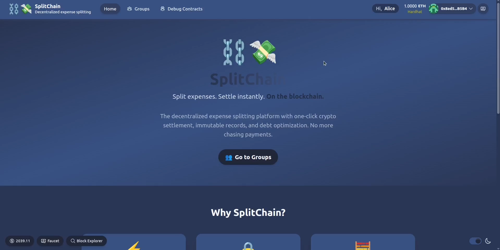
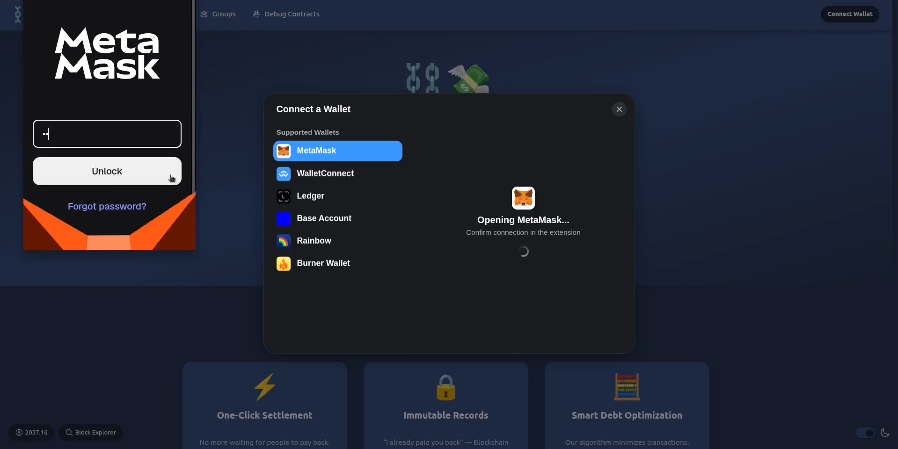
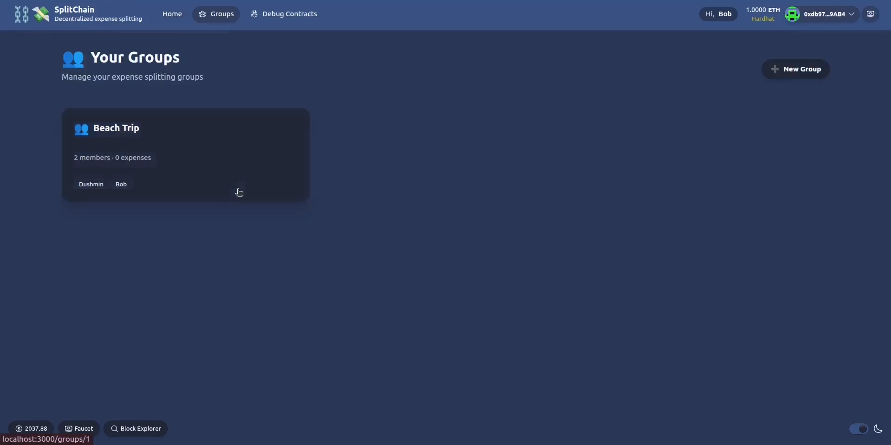
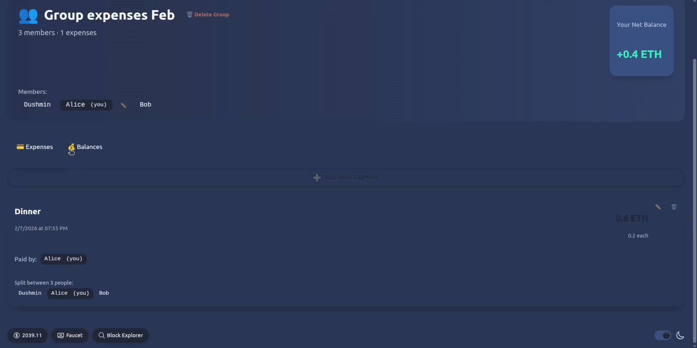
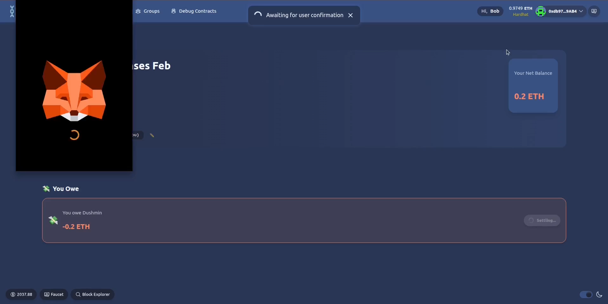
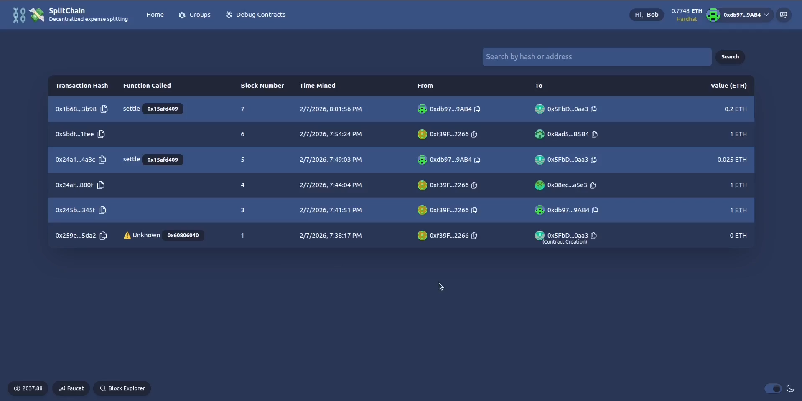

# 🪙 SplitChain

SplitChain is a decentralized expense settlement DApp built on the Ethereum blockchain. It allows users to create groups, split expenses off-chain, and settle debts securely on-chain.

**🎥 Watch our Demo:** [https://youtu.be/2mqw2Uw3qrE](https://youtu.be/2mqw2Uw3qrE)

---

### Application Walkthrough

Accessible via a user-friendly interface.



Connect with popular wallets like MetaMask, WalletConnect, Ledger, Base, and Rainbow.



Create a group with your friends.



Manage and track your group expenses seamlessly.



Settle expenses effortlessly on ETH blockchain!



Verify and explore your on-chain settlements on the Block explorer view.



---

## 🛠 Tech Stack

- **Frontend**: Next.js, RainbowKit, Wagmi, TailwindCSS
- **Smart Contracts**: Solidity, Hardhat
- **Database**: SQLite with Prisma

## 🚀 Quickstart

Before you begin, ensure you have Node.js and Yarn installed.

1. **Install dependencies:**
   ```bash
   yarn install
   ```

2. **Run local Ethereum network:**
   ```bash
   yarn chain
   ```

3. **Deploy smart contracts:**
   ```bash
   yarn deploy
   ```

4. **Start the Next.js app:**
   ```bash
   yarn start
   ```

Visit your app at `http://localhost:3000`.

---
Built with 🏗 Scaffold-ETH 2.